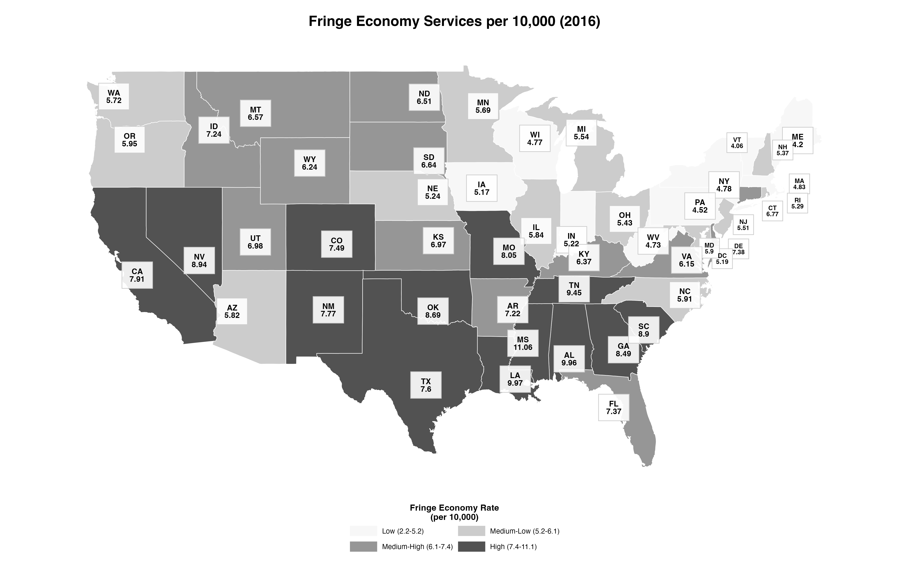
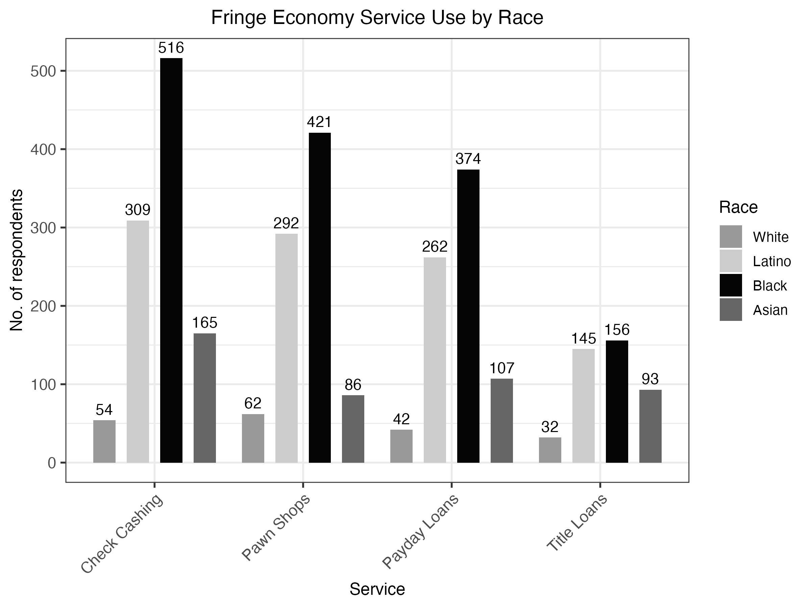
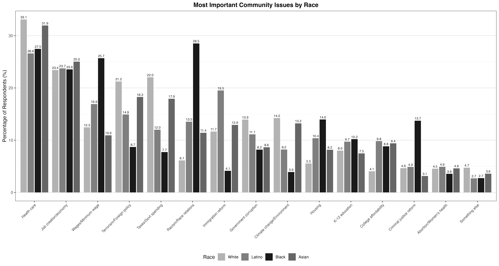
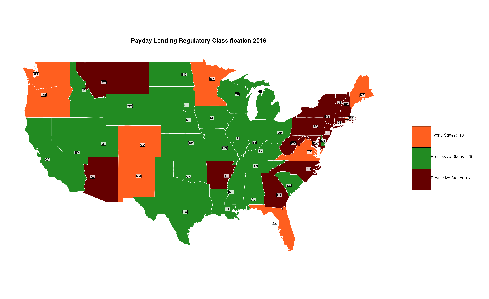
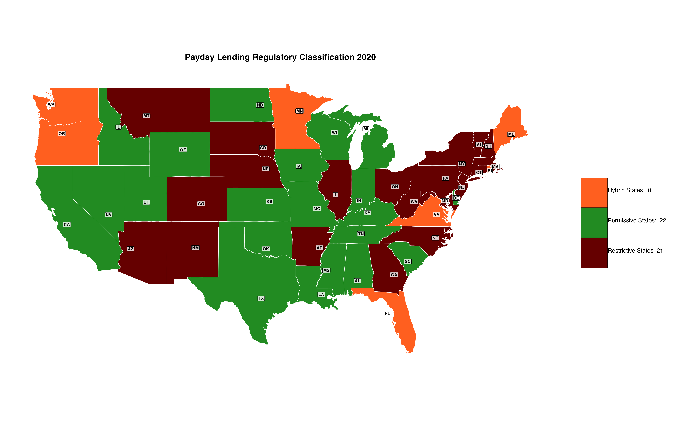
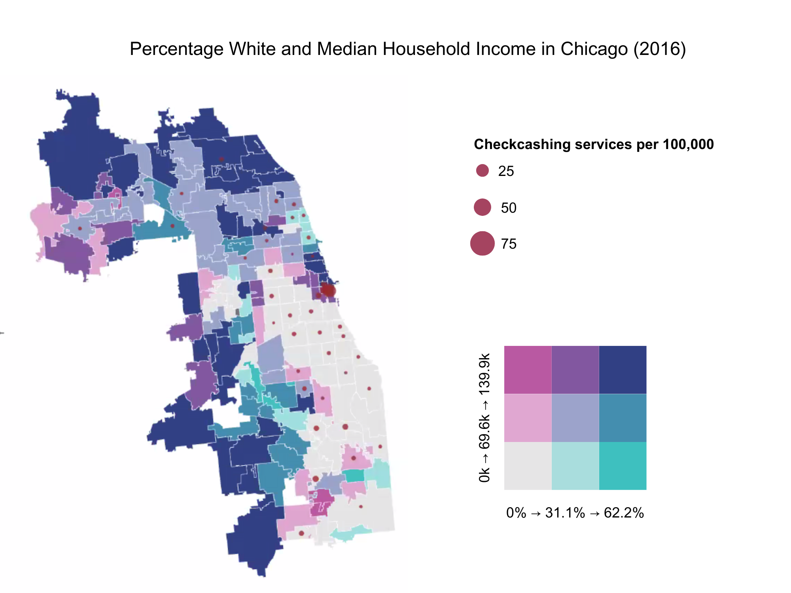
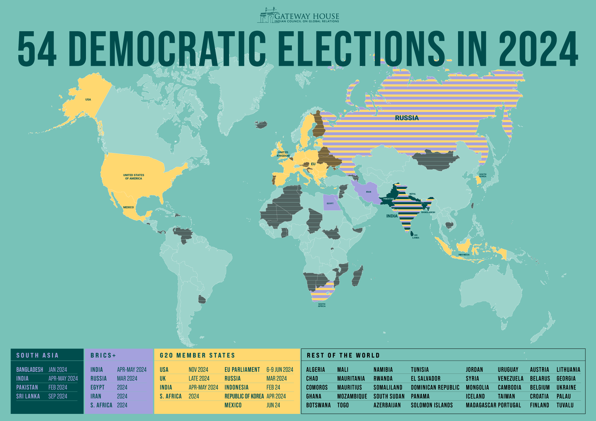
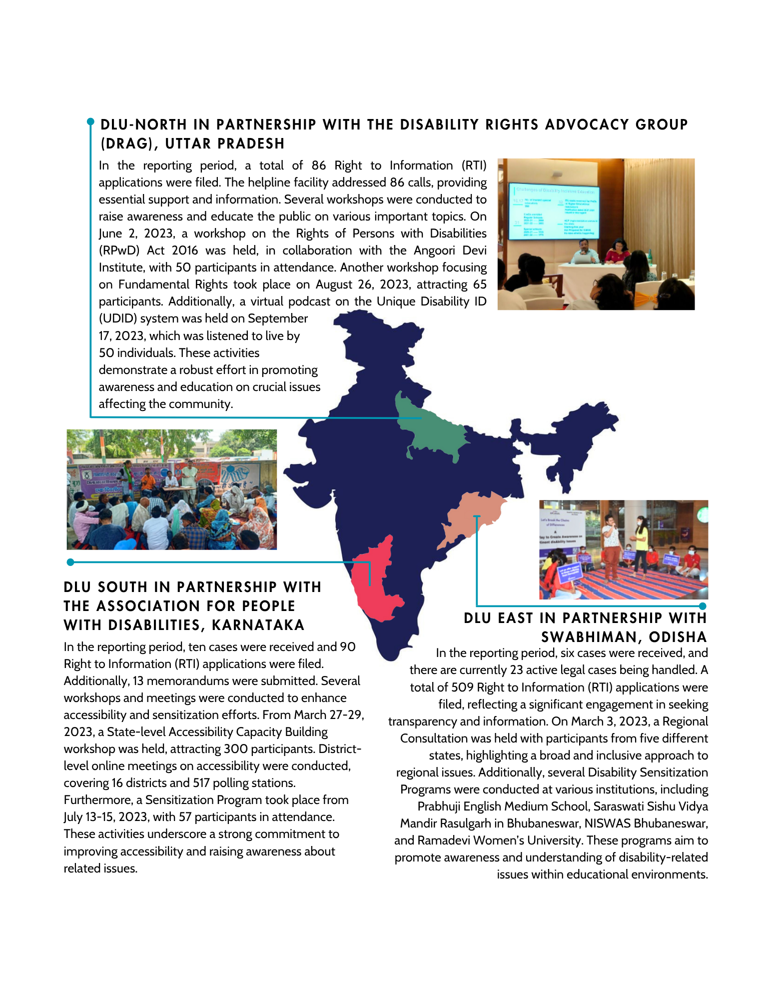
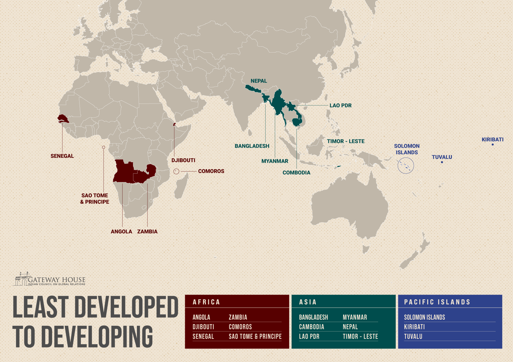
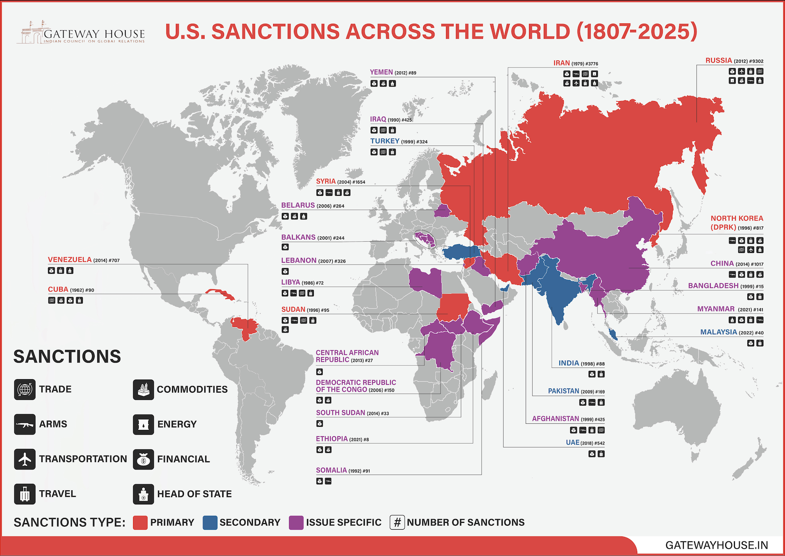

# Data Visualization Portfolio

Welcome to my data visualization portfolio! This repository showcases my expertise in transforming complex data into compelling visual stories using various tools and technologies.

## About Me

I'm Khushi Desai, a data scientist and artist passionate about transforming complex data into compelling visual narratives. Currently pursuing my MS in Computational Analysis and Public Policy at The University of Chicago, I bring a unique interdisciplinary perspective that combines rigorous analytical skills with creative artistic vision.

My background spans quantitative political science, international relations, and public policy research, where I've developed expertise in statistical modeling, machine learning, and data visualization. As an artist, I approach data visualization not just as a technical challenge, but as an opportunity to create meaningful, aesthetically compelling stories that make complex information accessible to diverse audiences.

I specialize in using data visualization to illuminate social and political phenomena, having worked on projects ranging from analyzing Chinese investments under the Belt & Road Initiative to examining the political economy of AI's impact on Indian labor markets. My work bridges the gap between academic research and public understanding, creating visualizations that inform policy discussions and social awareness.

## Technical Skills

**Programming Languages:**
- Python (Pandas, NumPy, Seaborn, Plotly, Matplotlib, SciKit-Learn, PyTorch)
- R (ggplot2, statistical modeling, data analysis)
- SQL for data extraction and manipulation
- LaTeX for document preparation

**Data Visualization Libraries:**
- Seaborn, Plotly, Matplotlib (Python)
- Geoplotlib, Folium for geographic visualization
- ggplot2 (R)

**Tools & Platforms:**
- STATA for statistical analysis
- SurveyCTO for survey design and data collection
- Qualtrics for survey research
- VBA in Excel for automation
- Wolfram Mathematica for computational analysis
- ArcGIS for geographic information systems
- Dedoose for qualitative analysis

**Specializations:**
- Statistical visualization and modeling (OLS, GLM, Poisson regression)
- Geographic mapping and spatial analysis
- Survey data visualization
- Political and economic data analysis
- Policy-focused data storytelling
- Qualitative and quantitative data integration

## Featured Projects

### 1. America's Fringe Economy: Financial Exclusion and Political Participation
**Tools Used:** R, ggplot2, ArcGIS, STATA

This project examines how America's $78 billion fringe economy—payday lenders, check cashers, and pawn shops—affects political participation across racial lines. Working with the Political Economy and Race Lab at The University of Chicago, I created visualizations that reveal the geographic and demographic patterns of financial exclusion.

**Key Visualizations:**

*Geographic distribution of fringe economy services per 10,000 residents across US states (2016). Mississippi shows the highest concentration at 11.06 services per 10,000 residents.*

*Distribution of fringe economy service usage across racial groups. Black Americans show the highest usage rates across all service types, with nearly 50% using check cashing and pawn shop services.*

*Analysis of most important community issues by race, showing how different racial groups prioritize various social and economic concerns.*

*Comparison of payday lending regulations between 2016 and 2020, showing the shift from 26 permissive states to 22, with 6 states moving to more restrictive policies.*

*Choropleth map showing bi-variate relationship between income, race and fringe economy (check-cashing) services in the city of Chicago.*

*Note: Black and white versions of maps are provided to improve accessibility for color-blind individuals.*

### 2. Gateway House Projects: South Asian Economic Analysis
**[Gateway House Indian Council on Global Relations](https://www.gatewayhouse.in/)** | **Tools Used:** R, GIS mapping, Database development

During my time as a visiting research assistant at Gateway House, I created visualizations analyzing global economic and political patterns, with a focus on South Asian development and international relations.

**Key Visualizations:**

*Map showing 54 democratic elections scheduled for 2024 worldwide. South Asian countries including Bangladesh, India, Pakistan, and Sri Lanka are highlighted, representing significant democratic participation in the region.*

*Geographic analysis of disability rights advocacy work across India, showing partnerships between DLU regional offices and local organizations. The map illustrates grassroots efforts spanning from Uttar Pradesh in the north to Karnataka in the south and Odisha in the east.*

*Global distribution of least developed countries (LDCs) categorized by region. The visualization shows significant concentration in Africa (8 countries), Asia (8 countries), and Pacific Islands (3 countries), highlighting global development disparities.*

*Comprehensive mapping of U.S. sanctions worldwide from 1807-2025, categorized by type (trade, arms, transportation, travel, commodities, energy, financial, head of state). The visualization reveals the geographic scope and complexity of contemporary sanctions regimes, with particular concentration in regions of geopolitical tension.*

**Research Contributions:**
- Analyzed Chinese investments in Pakistan and Nepal under the Belt & Road Initiative across 10+ projects
- Collaborated on Indo-Sri Lankan trade relations research, securing publication with KAS Japan
- Supervised creation of database covering 250+ non-profits with $50M+ in funding
- Contributed to macroeconomic analysis and project management for South Asian economic policy research
